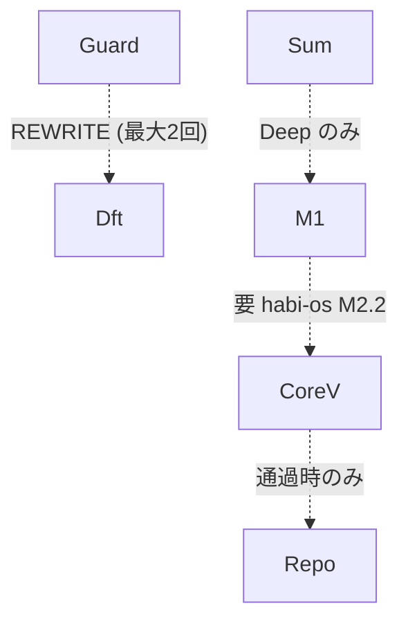

# Mermaid 点線エッジのラベル syntax

Mermaid flowchart で **点線エッジ (dotted edge) にラベルを付ける** 正しい記法は `-. "label" .->`。`-.|label|.->` は **parse error** になる。

## 症状

```mermaid
flowchart TB
  Guard -.REWRITE.-> Dft               %% NG (ラベルなし扱いで通る場合あり)
  Guard -.|REWRITE (最大2回)|.-> Dft   %% NG: パイプ記法は点線では invalid
  Sum -.|Deep のみ|.-> M1               %% NG: 同上
```

→ Mermaid renderer がブロック全体を **`Syntax error in text`** で reject、ダイアグラム全体が真っ赤になる。

## 正しい書き方



- 開始ハイフン `-` の後に `. "label" .` を挟む
- ラベルは **ダブルクオートで囲む** (= スペースや日本語含む場合は必須、英数字単独でも安全側で必ず囲む)
- 矢印先端は `.->` (`.-)` でも `.-x` でも記法は同じ)

## 通常エッジ (実線) と混同しがちなパターン

| エッジ | ラベルあり | ラベルなし |
|---|---|---|
| 実線 | `A -- "label" --> B` または `A -->|label| B` | `A --> B` |
| 太線 | `A == "label" ==> B` または `A ==>|label| B` | `A ==> B` |
| 点線 | `A -. "label" .-> B` (パイプ記法 NG) | `A -.-> B` |

→ 実線・太線ではパイプ `-->|label|` 記法が使えるが、**点線だけは仕様が違う**。`-.|label|.->` は v8 以降の Mermaid で長年踏まれている罠。

## 切り分け

- HTML 出力時に Mermaid block 全体が `Syntax error in text` で潰れたら、まず `flowchart` 内の **`-.` で始まるエッジを全部リストアップ** して `-.|...|.->` の有無を grep
- VS Code Mermaid preview と GitHub の Mermaid native render で挙動が違うことがある (= 古い preview は `-.|label|.->` も通してしまう)。GitHub の render が真実

## Links

- [[03_work/habi-bff]] — 2026-06-12 のステータスレポート HTML を作る際に踏んだ
- [Mermaid 公式: edges](https://mermaid.js.org/syntax/flowchart.html#types-of-links)
